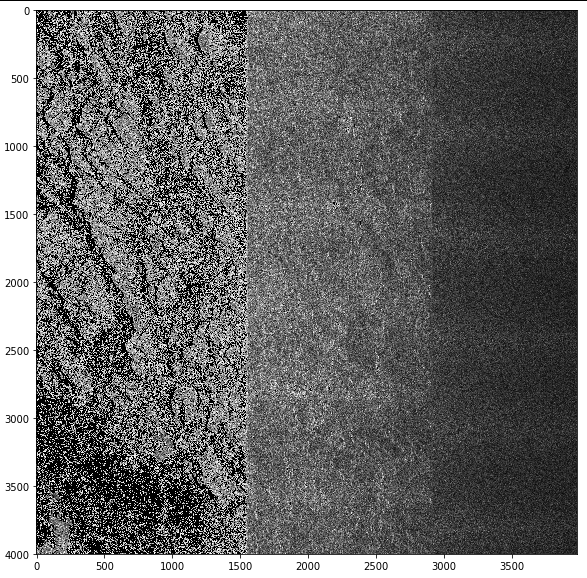
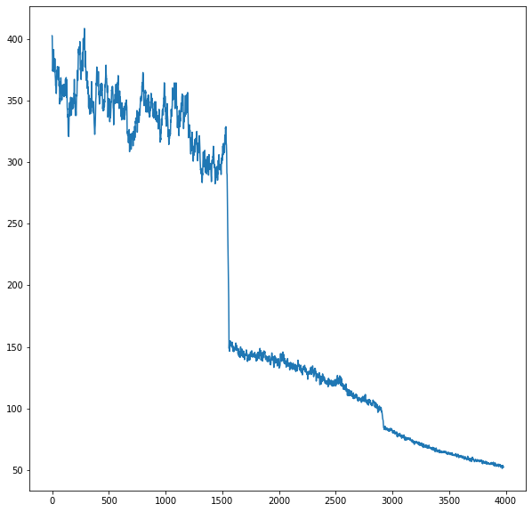
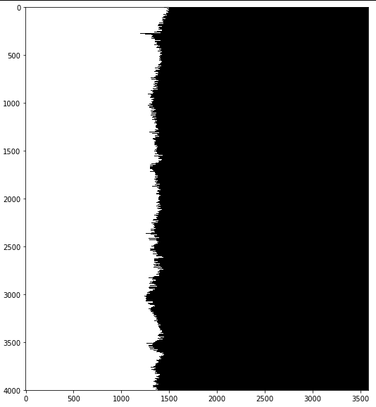

# Automatic-Image-Quality-Analysis
Automatic Image Quality Analysis (AIQA) has become a very crucial module in remote sensing industry. With increasing competition and institutions  that provide remote sensing images, the quality of images provided to the users has a huge impact.

`BrisqueFeatures.py` evaluates the image and gives a score in the range of 1-100. 100 being very bad quality. 

   `brisque_svm.txt` and `normalize.pickle` are supporting files to derive the Brisque feature based quality score.
   
`lineDetection.py` as the name suggests can detect lines in any direction. This file can be used to detect butting areas, banding and striping in satellite imagery

`pixelNoiseDetection.py`  can be used to detect any type of random pixel noises. It can detect hot/dead pixels in satellite images, also called salt and pepper noise.

`checkRadImbalance.py` can be used to detect an imbalance across and along images. 

### SAR Sample with Radiometry Imbalance
Here is a sample of SAR image with radiometry imbalance across the swath.

### Mean across axis=0 (along)
This is the aggregated mean across all rows for each column. It shows a clear shift in the radiometry.

### Detected Imbalance Mask
This is the output of the algorithm that produces a mask which shows the seperation of radiometry

